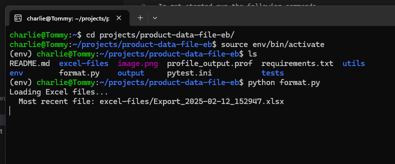

there are 2 input files.

1.  is the main shopify export.
2.  is a single file with urls only. (i think i should change the name of this column reference in the script so that it matches the shopify export)
    or i could make the script reference the first colmn only.

add both of these files to a folder called excel-files on the root of the project. Call each file "products.xlsx" and "urls.xlsx"

To get started run the following commands

1.`python3 -m venv env` - this will create an virutal env

2.`source env/bin/activate` - this will activate the venv in the shell

3.`pip install -r requirements.txt` - this will install lib modules

`python format.py` - this will run the script. make sure that the correct excel files are in the appropriate folder

ive got a new idea about the images:

- i could create a new dictionary that takes in the partent ID, and colour, and an image url
- and match this against a varient sku where the parent id matches, and the colour matches.

todos or a plan:

- we are reading the single export file
- instead of blacklist columns, whitelist them to only include desired.
- and build a better dictionary for the url maapping. i can use the ID column and colour to help match
  - so ill have a dic of ID, colour, url
  - and when we go through each row, find all urls where the ID and colour match?
- urls have correct info only within the url itself. and the parent ID will match the product.
  - i thought i was using the "image alt text" column from shopify, but i am making my own by removing the size from the sku.

stopping at this problem:

- still having problems here. csv file is showing a 0.0 in the int column. it needs to be whole number
- also having trouble with staple tee 5001-WHT. The image url name is not formatted correctly

# How to run and generate a file

1. start ubuntu app
2. you should see a <NAME>~$
3. type `cd projects/product-data-file` and hit enter
4. type `source env/bin/activate` and hit enter

   

5. type `python format.py` and enter again

   

6. sit back and wait! the file will get created in the projects/product-data-file-eb/output folder
